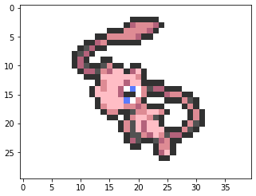
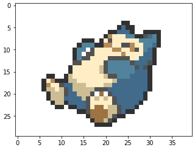

# pokemon-sprites
Generate high-resolution sprites from GEN 1.

## Usage

Two functions can be used to generate pokemon sprites.

Use the following code to generate pokemon sprite with given name (e.g. Mew - #151):
``` python
show_pokemon_name("meo")
```
then you will get



Use the following code to generate pokemon sprite with given index (e.g. Snorlax - #143):
``` python
show_pokemon_index(143, pokemon_list)
```
then you will get


